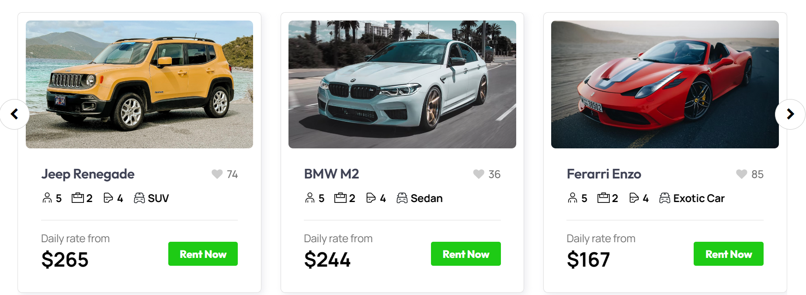
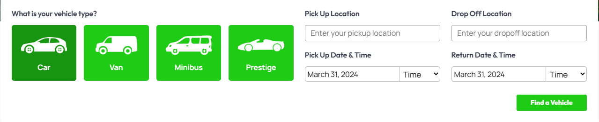
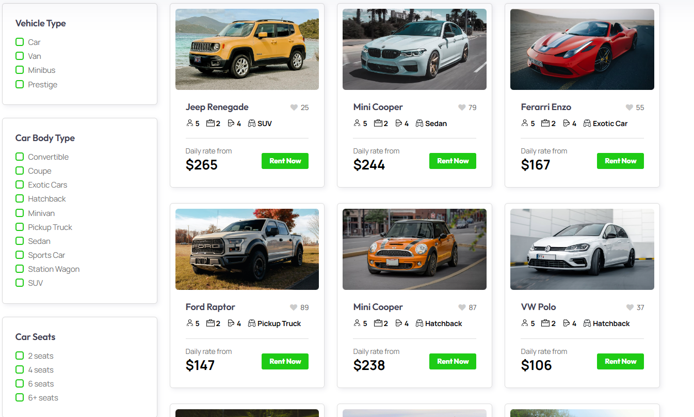
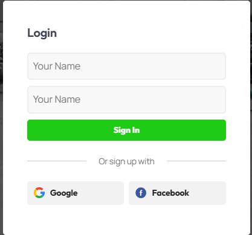
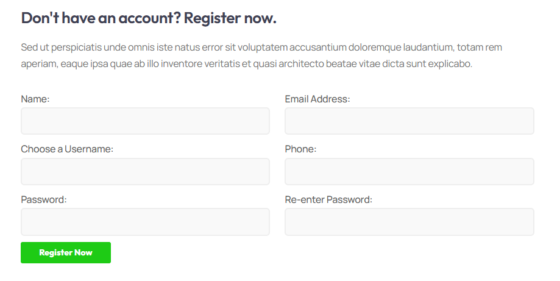
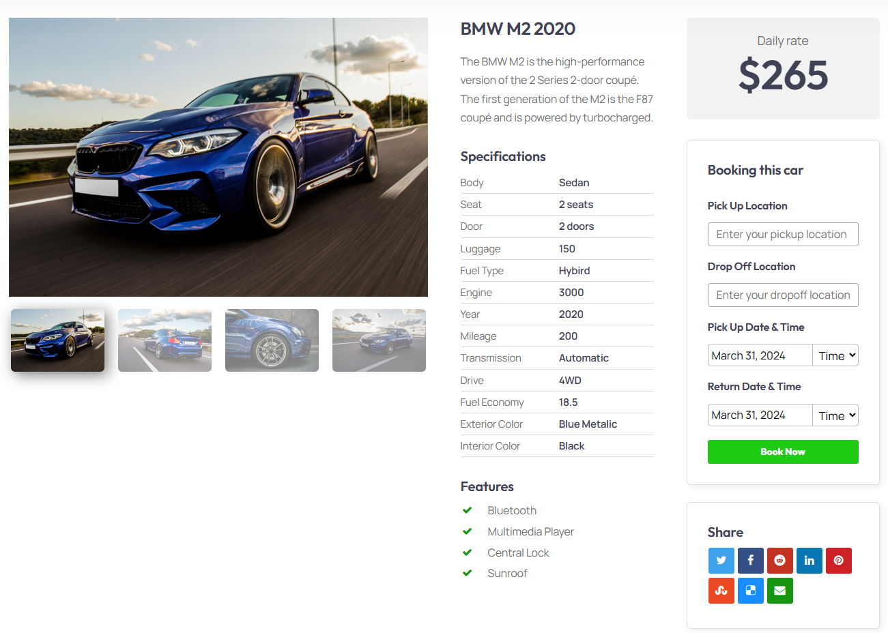
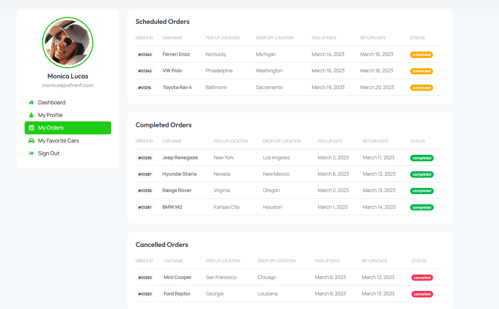
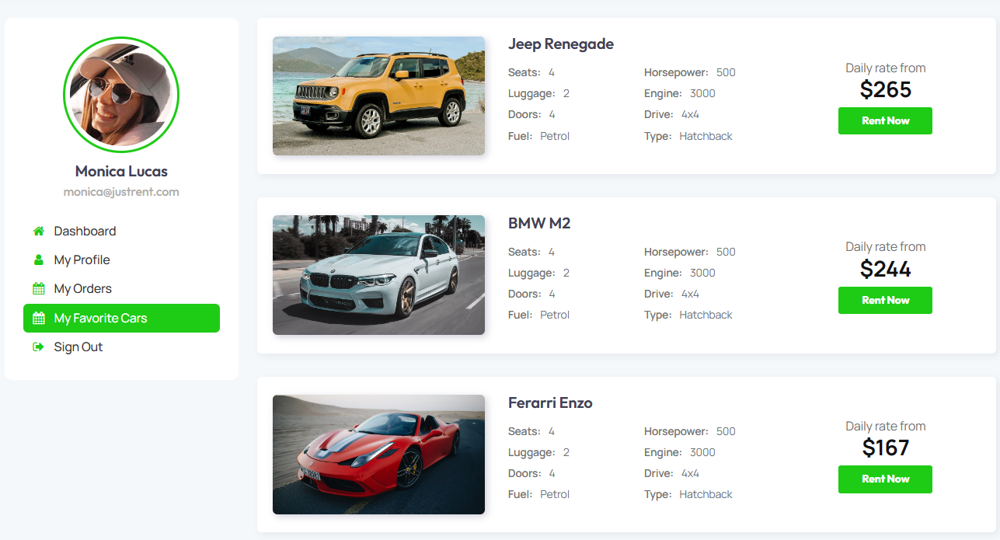

# 撰寫各頁面的 User Story

## 主頁

使用者在首頁，可以使用輪播功能，挑選自己喜愛的車。

## Booking

使用者在頁面可以選擇空車與可以訂車的時間/地點，和還車的時間/地點。

## Car

使用者在頁面可以選擇特定的車款，例如:2 人座的敞篷車且要 3000CC

## login

使用者在頁面進行登入

## Register

使用者在頁面進入註冊

## car-single

使用者在頁面可以看到該車的租金，和能訂車的時間與地點。

## account

使用者在頁面可以看到訂單狀況，例如預定的訂單/目前的訂單/取消的訂單。

## account-favorite

使用者在頁面可以看到自己收藏的車款

